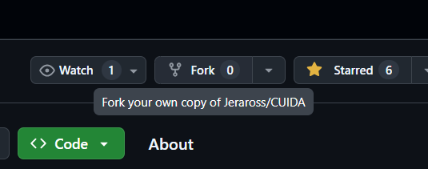
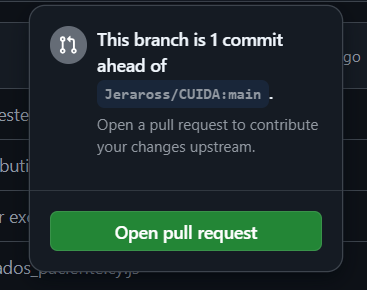

![contribute]

## Bem-vindo(a)! 
Se você chegou até aqui, é provável que tenha interesse em contribuir com o **CUIDA**, um software de gestão hospitalar desenvolvido em Django. O CUIDA foi criado para otimizar o atendimento e a organização de dados de pacientes, facilitando o trabalho de profissionais de saúde. Antes de começar a colaborar, leia este guia para entender melhor como nosso sistema funciona e como você pode ajudar a melhorar ainda mais essa ferramenta.

<br>

## Como contribuir:
Você pode colocar uma nova funcionalidade em prática, solucionar alguma issue do projeto (botão abaixo) ou adicionar uma melhoria.
<br>
<p align="center">
  <a href="https://github.com/Jeraross/CUIDA/issues">
    
  </a>
</p>

<br>

## Configurando o repositório

<strong>1º) Fork do Repositório:</strong> Faça um Fork para levar uma cópia do repositório para a sua conta.  Dessa forma, você pode realizar suas modificações sem impactar o repositório original. 
<br>
<p align="center">
  
</p>

<strong>2º) Clonar o repositório:</strong> 
```
git clone https://github.com/SuaConta/CUIDA.git
```

<strong>3º) Criar sua própria Branch:</strong> 
```
git checkout -b minha-nova-funcionalidade
```

<br>

## Configurando o ambiente de desenvolvimento

<strong>1º) Entre no Diretório do Projeto:</strong>
```
cd CUIDA
```

<strong>2º) Crie um Ambiente Virtual:</strong>
```
python -m venv venv
```

<strong>3º) Ative o Ambiente Virtual:</strong>
```
Windows: venv\Scripts\activate
Linux/Mac: source venv/bin/activate
```

<strong>4º) Instale as Dependências:</strong>
```
pip install -r requirements.txt
```

<strong>5º) Aplique as Migrations (Criar o Banco de Dados):</strong>
```
python manage.py migrate
```

<strong>6º) Rode o Servidor:</strong>
```
python manage.py runserver
```

## Caso queira garantir que o código adicionado não quebre outras partes da aplicação:
rode os testes existentes e, caso necessário, crie novos testes. Para fazer isto:

<strong>1º) Baixe o <a href="https://nodejs.org/en" target="_blank">Node</a> na sua versão LTS:</strong>

<strong>2º) Instale as dependências:</strong>
```
npm ci
```

<strong>2º) Rode os testes com:</strong>
```
npx cypress run
```

<br>

## Confirmando suas Alterações
Abra um Pull Request com uma descrição das alterações realizadas.

<strong>1º) No repositório que você deu fork, clique em ```Contribute```:</strong>

<p align="center">
  
</p>

<strong>2º) Depois clique em ```Open pull request```:</strong>

<p align="center">
  
</p>

<strong>3º) Agora selecione o repositório que você deu fork e a branch que você fez suas alterações:</strong>

<p align="center">
  
</p>

<strong>4º) Então, para criar seu PR, clique em ```Create pull request```:</strong>

<p align="center">
  
</p>

<strong>5º) No final:</strong>

<p>A equipe do CUIDA irá revisar sua submissão e, caso algo não esteja em conformidade com o projeto, entraremos em contato para ajustar o seu código.</p>

<br>

## 🙏 Agradecimentos!

A equipe do **CUIDA** agradece imensamente pela sua contribuição! Cada sugestão, melhoria e ajuste faz uma grande diferença para que possamos oferecer um sistema de gestão hospitalar ainda mais eficiente e otimizado para os profissionais de saúde.

Estamos animados para ver suas ideias em ação e trabalharmos juntos para transformar o atendimento e a organização de dados dos pacientes.

<br>

Se precisar de qualquer coisa ou tiver dúvidas durante o processo, não hesite em entrar em contato. Muito obrigado por ajudar a tornar o **CUIDA** cada vez melhor!

<br>
<br>
Fale com a gente:
- [Guilherme Mourão](https://github.com/guilhermemouraovc) - gmvc@cesar.school
- [Henrique Figueiredo](https://github.com/fthenri) - hft@cesar.school
- [Henrique Gueiros](https://github.com/henrique-gueiros) - hwg@cesar.school
- [Jeronimo Rossi](https://github.com/Jeraross) - jbr2@cesar.school
- [João Pedro Aguiar](https://github.com/Jp-moraiss) - jpam@cesar.school
- [Maria Julia Dantas](https://github.com/mariajuliadantas) - mjdma@cesar.school

<br>
